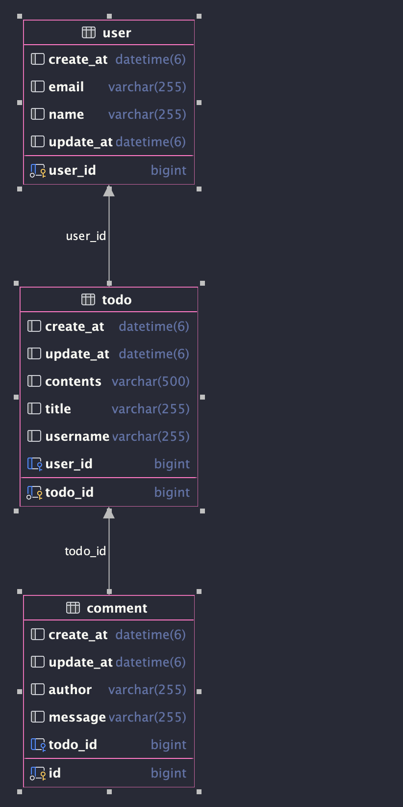

# **필수 구현 API 명세서**

| Function  | Method | URL                 | Request        | Response                   |
|-----------|--------|---------------------|----------------|----------------------------|
| 일정 저장     | POST   | /api/todo           | 제목,내용,유저명,이메일  | 제목,내용,유저명,이메일.작성/수정일       |        
| 일정 수정     | PUT    | /api/todo/{id}      | 일정id,유저명,제목,내용 | 제목,내용,유저명,이메일,작성/수정일       |        
| 일정 삭제     | DELETE | /api/todo/{id}      | ''             | "complete message"         |        
| 일정 단건 조회  | GET    | /api/todo/{name}    | ''             | [제목,내용,유저명,이메일,작성/수정일]...  |        
| 일정 페이징 조회 | GET    | /api/todo/pageList  | x              | [제목,내용,댓글개수,작성/수정일,유저명]... |         
| 댓글 저장     | POST   | /api/comment        | 일정id,작성자,내용    | 일정정보[작성자,댓글내용,작성일,수정일]     |      
| 댓글 조회     | GET    | /api/comment/{user} | 유저명            | 작성자,댓글내용,작성일,수정일           |        
| 댓글 전체 조회  | GET    | /api/comment/list   | x              | [작성자,댓글내용,작성일,수정일]...      |        
| 댓글 수정     | PUT    | /api/comment        | 일정id,작성자,내용    | 유저명,댓글내용,작성일,일정id          |        
| 댓글 삭제     | DELETE | /api/comment/{id}   | 댓글id           | "complete message"         |        
| 유저 저장     | POST   | /api/user           | 유저명,이메일        | 유저식별id,유저명,이메일,작성/수정일      |        
| 유저 조회     | GET    | /api/user?name=유저명  | ''             | 유저식별id,유저명,이메일,작성/수정일      |        
| 유저 전체 조회  | GET    | /api/users          | x              | [유저식별id,유저명,이메일]...        |        
| 유저 수정     | PUT    | /api/user           | 유저명            | 유저식별id,유저명,이메일,작성/수정일      |        
| 유저 삭제     | DELETE | /api/user           | 유저명            | "complete message"         |        

# **필수 구현 ERD**
